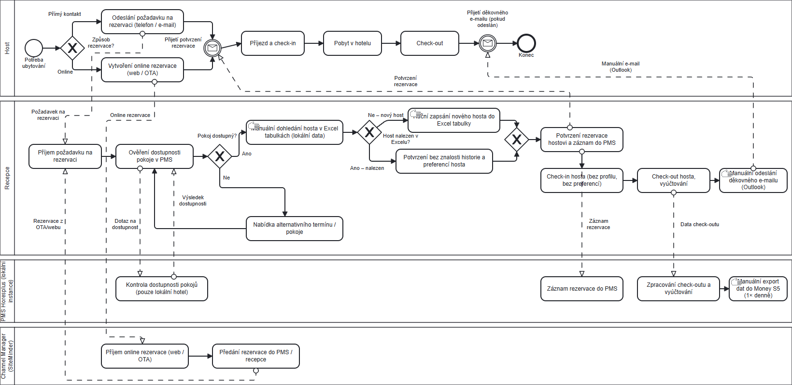
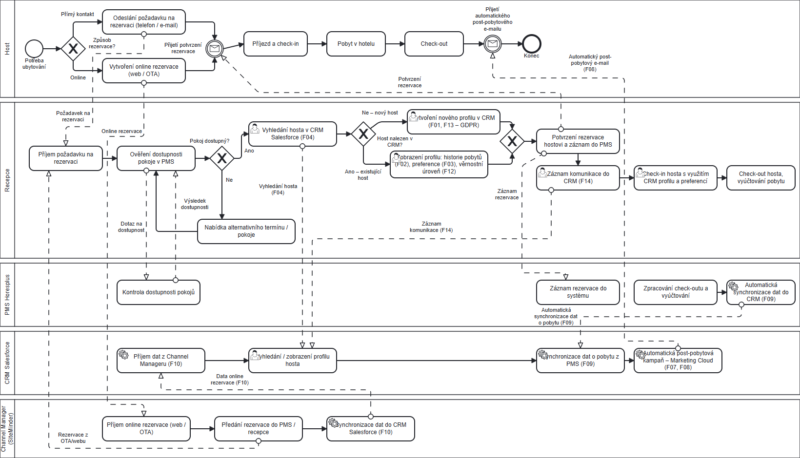

**Česká zemědělská univerzita v Praze**

**Provozně ekonomická fakulta**

{width="4.444444444444445in" height="3.0972222222222223in"}

**Semestrální projekt**

**Integrace CRM systému salesforce do sítě hotelů**

**Herian Petr**\
**Herian Ondřej**\
**Vácha Svatopluk**\
**Kafoněk Marek**\
**Kroča Alex**\
**Nica Sergiu**

**© 2026 ČZU v Praze**\
**Obsah**

[**1 Úvod (Sváťa) 4**](#úvod-(sváťa))

[**2 Charakteristika podniku (Sváťa) 4**](#charakteristika-podniku-(sváťa))

[2.1 Základní údaje o podniku: 4](#X69d4bb7c3fdf35f525a62f751889b7da22d47b5)

[2.2 Cílová skupina 5](#Xfb83ffadf29880413b752125c147c822c260193)

[2.3 Organizační struktura 5](#X4d2bbe69e8b6f2bd03cd98c287099437606725e)

[2.4 Ekonomické ukazatele 6](#X813bd4814f486e93a01c0971c969059d7dc41f5)

[**3 Profil systémového integrátora (Sváťa) 7**](#profil-systémového-integrátora-(sváťa))

[3.1 Ekonomické ukazatele 8](#Xab2c40e7e93716bcb75efab759d5dc2613a2c20)

[**4 Petr Globální strategie zadavatelského podniku (východiska, globální cíle podniku, stručná SWOT analýza, portfolio produktů, ...). 9**](#Xa7e7671b31883e8b823a4e9168ad566575ef21c)

[**5 Petr Informační strategie podniku (východiska -- stávající situace IS/IT, vztah IS k okolí -- výchozí kontextový diagram (stávající situace), stanovení cílů, kritéria (dimenze), CSF (kritické faktory úspěchu)). 9**](#X2bc083dc8fec0355bd8ed4d67d33844648241a4)

[**6 Ondra Business architektura 9**](#ondra-business-architektura)

[6.1 Výběr a návrh podnikového procesu pro který bude integrován nový IS, modul nebo funkcionalita (BPMN) 9](#Xbdfba3145d83aabb047a54768f05cac84e63f4c)

[6.2 Katalog uživatelských požadavků -- funkční, nefunkční (ve formě tabulky: číslo a název požadavku, popis požadavku, aktor, složitost, priorita, návaznost) 9](#X350623c01cfd7820a41dbee3f60dafe42956e7b)

[**7 Marek (kafonmar) - Datová architektura -- návrh nových informačních toků: 1) nový kontextový diagram, 2) DFD první úrovně (DFD) a 3) návrh struktury databáze (ERD). 9**](#Xd688f7a84d91021b435abe0563b8d589981f2ef)

[**8 Alex Aplikační architektura -- zjednodušený objektový model IS/modulu/funkcionality a jeho komponent (UML -- diagram tříd a Use Case). 9**](#X6e15c9d05b26a820b3e915f560726328a6a0f1a)

[**9 Sergiu Technologická architektura (formou přehledných tabulek) 9**](#Xc863e9cc4c4025a8ffaad2ee98342c10b841c4d)

[9.1 Požadavky na externí informační zdroje (konkrétní externí zdroje vzhledem k typu a zaměření podniku) -- finanční databáze atp. 9](#X89cca283cafcf68624d51318acb8c0700cada1f)

[9.2 Požadavky na technické vybavení (servery, počítače, ...): typy, cena, podmínky dodávky, záruka, servis, ...) 10](#Xe0bfcd9bdfdf95120ac912e338014563d992049)

[9.3 Požadavky na SW (základní, aplikační): typy (licence), cena, podmínky dodávky, záruka, servis. 10](#X3868400629e7b929a5b8481511165c1c30c152a)

[9.4 Bezpečnost systému (SW/HW prostředky, metody, personální zabezpečení, náklady) 10](#X30e9c6f5ef9b16dc3ada4d637a61b641e6651ed)

[9.5 Požadavky na specializovaný personál (správa IT/IS). 10](#X2f560e5d60cbeb166d2cd044112a037c978db0b)

[9.6 Požadavky na školení všech koncových uživatelů. 10](#požadavky-na-školení-všech-koncových-uživatelů.)

[**10 Svata Integrační plán -- Harmonogram (aktivita, termín, zodpovědný pracovník / zodpovědní pracovníci), finanční náklady za celý projekt (Ganttův diagram / tabulka). 10**](#X450c5eff46dcaf0b46cabe049f569fd71d0f7dc)

[**11 Seznam použitých zdrojů 10**](#seznam-použitých-zdrojů)

[**12 Seznam obrázků, tabulek, grafů a zkratek 10**](#seznam-obrázků,-tabulek,-grafů-a-zkratek)

[12.1 Seznam obrázků 11](#seznam-obrázků)

[12.2 Seznam tabulek 11](#seznam-tabulek)

[12.3 Seznam grafů 11](#seznam-grafů)

[12.4 Seznam použitých zkratek 11](#seznam-použitých-zkratek)

[**Přílohy 12**](#přílohy)

# 

# **Úvod (Sváťa)** {#úvod-(sváťa)}

Tato semestrální práce se zabývá návrhem integrace CRM systému Salesforce do sítě hotelů. Cílem je navrhnout řešení, které podpoří řízení vztahů se zákazníky, sjednotí práci s informacemi o hostech a přispěje ke zefektivnění vybraných podnikových procesů. Projekt je zaměřen na integraci informačního systému do prostředí větší organizace a vychází z principů podnikové architektury.

Práce obsahuje charakteristiku podniku a systémového integrátora, návrh globální a informační strategie a dále zpracování business, datové, aplikační a technologické architektury. Součástí studie je také integrační plán, který zahrnuje harmonogram projektu a odhad finančních nákladů.

# **Charakteristika podniku (Sváťa)** {#charakteristika-podniku-(sváťa)}

Pro účely této semestrální práce byl zvolen fiktivní podnik Aurora Hotels a.s., který působí v oblasti hotelových a ubytovacích služeb. Společnost provozuje síť 7 hotelů ve větších městech České republiky a zaměřuje se na poskytování služeb pro soukromou i firemní klientelu. Kromě samotného ubytování nabízí také doplňkové služby, jako jsou konferenční prostory, wellness služby, restaurační služby a pořádání firemních akcí.

Podnik byl zvolen jako modelový příklad středně velké organizace, ve které je vhodné řešit integraci CRM systému. V prostředí hotelové sítě vzniká potřeba centralizované evidence zákazníků, sjednocení komunikace se zákazníky a lepší podpory marketingových a obchodních aktivit napříč jednotlivými hotely (pobočkami).

## **2.1 Základní údaje o podniku:**

Název společnosti: Aurora Hotels a.s.\
Sídlo: Praha\
Oblast podnikání: hotelnictví a související služby\
Působnost: Česká republika\
Počet hotelů: 7\
Cíloví zákazníci: individuální hosté, firemní klientela, turisté a organizátoři akcí

## **2.2 Cílová skupina**

Cílovou skupinu společnosti tvoří především individuální hosté cestující za turistikou nebo pracovně, dále firemní klientela využívající ubytování a konferenční služby a také zahraniční návštěvníci. Část zákazníků představují rovněž organizátoři školení, seminářů, firemních setkání a společenských akcí.

Z hlediska budoucí integrace CRM systému je důležité, že podnik pracuje s různými typy zákazníků, u nichž je vhodné evidovat historii pobytů, preference hostů, poptávky, rezervace a komunikační historii.

## **2.3 Organizační struktura**

Organizační struktura podniku odpovídá uspořádání středně velké hotelové sítě s centrálním vedením a několika pobočkami (hotely). V čele společnosti stojí generální ředitel, pod kterým se nachází útvar managementu, který je zodpovědný za koordinaci jednotlivých hlavních podnikových útvarů. Pro integraci nového CRM systému je důležité zejména IT oddělení, které zajišťuje provoz informačních systémů, technickou podporu uživatelů a správu podnikové infrastruktury.

IT oddělení má v rámci navrhované integrace CRM systému Salesforce klíčovou roli, protože bude odpovídat za technickou koordinaci projektu, spolupráci se systémovým integrátorem a následnou správu řešení.

Hlavními útvary podniku jsou:

- Generální ředitel
  - Management (zodpovědný za vedení a koordinaci jednotlivých hlavních útvarů)
    - Provoz hotelů
    - Obchod a marketing
    - Finance a controlling
    - Lidské zdroje
    - IT oddělení
    - Zákaznická péče
    - Údržba a úklidové služby

Organigram podniku Aurora Hotels a.s.

{width="5.833333333333333in" height="2.9166666666666665in"}

*Obrázek 1: Organigram podniku Aurora Hotels a.s.*

## **2.4 Ekonomické ukazatele**

Podnik je ekonomicky stabilní středně velké společnost s dostatečnými zdroji pro realizaci projektu systémové integrace a modernizaci svého informačního prostředí.

  -------------------------------------------------------------
  Ukazatel                                  Hodnota
  ------------------------------ ------------------------------
  Roční obrat                             320 mil. Kč

  Provozní zisk                            30 mil. Kč

  Výsledek hospodaření                     21 mil. Kč

  Celková aktiva                          260 mil. Kč

  Vlastní kapitál                          85 mil. Kč

  Počet zaměstnanců                           280
  -------------------------------------------------------------

*Tabulka 1: Ekonomické ukazatele Aurora Hotels, a.s.*

# **Profil systémového integrátora (Sváťa)** {#profil-systémového-integrátora-(sváťa)}

Systémovým integrátorem je firma Seyfor, a.s. (dříve Solitea, a.s.) založená v roce 1990 Martinem Cíglerem. Nyní patří mezi významné dodavatele podnikových informačních systémů a služeb digitální transformace ve střední Evropě. Společnost sídlí v Brně na adrese Drobného 49, 602 00 Brno. Poskytuje široké portfolio produktů a služeb v oblasti podnikových informačních systémů. Podle oficiálních materiálů se zaměřuje zejména na ERP a účetní systémy, CRM systémy, HR systémy, pokladní systémy, IT infrastrukturu, datovou analytiku a zakázkový vývoj. Společnost rozšířila své působení na trhy ve Slovinsku, Chorvatsku a Srbsku. Do tohoto regionu vstoupila prostřednictvím akvizic lokálních dodavatelů softwaru.

Od Seyfor, a.s. byla vybrána CRM platforma Salesforce. CRM platform Salesforce je určena pro obchod, marketing a zákaznickou podporu. Propojuje prodej, služby, marketing, obchod, IT a analytiku prostřednictvím digitálních pracovních postupů, které umožňují zcela nový způsob práce.

Seyfor jako implementační partner pomáhá firmám automatizovat procesy, personalizovat komunikaci a zlepšovat zákaznickou zkušenost. Platforma Salesforce podle Seyforu sjednocuje týmy, data a workflow v bezpečném cloudovém prostředí.

Z hlediska navrhovaného projektu je tato kombinace důležitá, protože hotelová síť potřebuje nejen samotný CRM nástroj, ale i partnera schopného zajistit jeho implementaci, přizpůsobení procesům podniku a integraci s dalšími používanými systémy.

Seyfor na svých stránkách zveřejňuje případové studie projektů postavených na Salesforce, například pro společnosti Kofola, BATIST Medical nebo Albatros Media. Tyto reference ukazují, že firma má zkušenosti s nasazením CRM řešení v prostředí, kde je nutné propojit zákaznická data, komunikaci a obchodní procesy.

## **3.1 Ekonomické ukazatele**

  ---------------------------------------------------------------
  Ukazatel                                    Hodnota
  -------------------------------- ------------------------------
  Roční obrat (r. 2024)                     4,6 mld. Kč

  Provozní zisk (r. 2024)                   527 mil. Kč

  Výsledek hospodaření (r. 2024)           276,7 mil. Kč

  Celková aktiva (r. 2024)                  5,3 mld. Kč

  Vlastní kapitál (r. 2024)                 2,4 mld. Kč

  Počet zaměstnanců (r. 2024)                   1850
  ---------------------------------------------------------------

*Tabulka 2: Ekonomické ukazatele Seyfor, a.s.*

# 

# **Globální strategie zadavatelského podniku**

## **4.1 Východiska**

Společnost Aurora Hotels a.s. působí na českém hotelovém trhu již přes 15 let a provozuje síť 7 hotelů ve větších městech České republiky (Praha, Brno, Ostrava, Plzeň, Olomouc, Liberec a České Budějovice). Podnik se zaměřuje na poskytování ubytovacích služeb pro individuální hosty i firemní klientelu, přičemž nabídku rozšiřuje o doplňkové služby -- konferenční prostory, wellness, gastronomii a organizaci firemních akcí.

V současné době podnik disponuje stabilní zákaznickou základnou a dosahuje ročního obratu 320 mil. Kč při 280 zaměstnancích. Řízení vztahů se zákazníky je však roztříštěné -- jednotlivé hotely vedou evidenci hostů odděleně, marketingové kampaně nejsou koordinovány centrálně a neexistuje jednotný přehled o historii pobytů a preferencích hostů napříč celou sítí. Tento stav omezuje schopnost podniku efektivně cílit nabídky, budovat věrnostní programy a poskytovat konzistentní zákaznickou zkušenost.

Vedení společnosti proto rozhodlo o zavedení centrálního CRM systému Salesforce, který by sjednotil správu zákaznických dat, podpořil obchodní a marketingové procesy a posílil konkurenceschopnost celé hotelové sítě.

## **4.2 Portfolio služeb**

Aurora Hotels a.s. nabízí svým zákazníkům následující služby:

- **Ubytovací služby** -- standardní a nadstandardní pokoje, apartmány, dlouhodobé pobyty
- **Konferenční a kongresové služby** -- pronájem konferenčních místností, technické zázemí, organizace firemních akcí a školení
- **Gastronomické služby** -- hotelové restaurace, snídaňové formáty, cateringové služby pro akce
- **Wellness a relaxační služby** -- wellness centra, sauny, fitness (dostupné ve vybraných hotelech)
- **Doplňkové služby** -- concierge, transfery, turistický servis, parkování

Z hlediska integrace CRM systému je důležité, že portfolio služeb je široké a zákazníci mohou využívat různé kombinace služeb napříč jednotlivými hotely. Centrální evidence zákaznických preferencí a historie využití služeb umožní personalizovanější přístup a cílenější nabídky.

## **4.3 Stanovení cílů**

Hlavním globálním cílem společnosti Aurora Hotels a.s. je **zvýšení tržeb a ziskovosti prostřednictvím zlepšení řízení vztahů se zákazníky a zvýšení míry opakovaných pobytů**. Tohoto cíle podnik plánuje dosáhnout pomocí následujících dílčích cílů:

1.  **Centralizace zákaznických dat** -- sjednocení evidence hostů ze všech 7 hotelů do jednoho systému
2.  **Zvýšení míry opakovaných návštěv** -- zavedení věrnostního programu založeného na datech z CRM
3.  **Zefektivnění marketingových kampaní** -- cílení nabídek na základě segmentace zákazníků, historie pobytů a preferencí
4.  **Zlepšení zákaznické zkušenosti** -- personalizace služeb díky dostupnosti kompletní historie hosta v celé síti
5.  **Zvýšení obsazenosti v mimosezónních obdobích** -- využití CRM pro automatizované kampaně a speciální nabídky
6.  **Posílení firemní klientely** -- systematická správa firemních kontaktů, smluv a poptávek konferenčních služeb

## **4.4 SWOT analýza**

  ------------------------------------------------------------------------------------------------------------------------------------------------------------------------------
                          **Pozitiva**                                                             **Negativa**
  ----------------------- ------------------------------------------------------------------------ -----------------------------------------------------------------------------
     **Vnitřní původ**    **Silné stránky**                                                        **Slabé stránky**

                          Stabilní zákaznická základna a dobré jméno                               Roztříštěná evidence zákazníků napříč hotely

                          Síť 7 hotelů ve strategických městech ČR                                 Absence centrálního CRM systému

                          Široké portfolio služeb (ubytování, konference, wellness, gastronomie)   Nekoordinované marketingové aktivity

                          Kvalifikovaný personál s dlouholetými zkušenostmi                        Omezená schopnost vyhodnocovat zákaznická data

                          Stabilní ekonomické výsledky                                             Nízká míra digitalizace zákaznických procesů

     **Vnější původ**     **Příležitosti**                                                         **Hrozby**

                          Rostoucí poptávka po personalizovaných službách v hotelnictví            Silná konkurence mezinárodních hotelových řetězců (Marriott, Hilton, Accor)

                          Trend digitalizace a využívání CRM v pohostinství                        Závislost na sezónnosti a výkyvech cestovního ruchu

                          Růst firemního cestovního ruchu v ČR                                     Růst nákladů na energie a provoz

                          Možnost využití dat pro cross-selling a up-selling služeb                Nedostatek kvalifikovaných pracovníků v hotelnictví

                          Rozvoj online rezervačních kanálů a OTA platforem                        Ekonomická nejistota a možný pokles poptávky
  ------------------------------------------------------------------------------------------------------------------------------------------------------------------------------

*Tabulka 3: SWOT analýza Aurora Hotels a.s.*

## **4.5 Strategie naplnění cílů**

### **4.5.1 Centralizace zákaznických dat**

Využití hodnocení W-O (slabé stránky × příležitosti). Současná roztříštěná evidence zákazníků brání efektivnímu využití rostoucí poptávky po personalizovaných službách. Zavedením CRM systému Salesforce dojde ke sjednocení zákaznických dat ze všech 7 hotelů do jedné centrální databáze. Každý host bude mít jednotný profil obsahující historii pobytů, preference, komunikační historii a využité služby bez ohledu na to, ve kterém hotelu sítě byl ubytován.

### **4.5.2 Zvýšení míry opakovaných návštěv**

Na základě centralizovaných dat bude možné vytvořit věrnostní program, který bude odměňovat opakované hosty napříč celou sítí. CRM umožní automaticky identifikovat segmenty zákazníků s vysokým potenciálem pro opakovanou návštěvu a cílit na ně personalizované nabídky (narozeninové slevy, sezónní balíčky, pozvánky na akce).

### **4.5.3 Zefektivnění marketingových kampaní**

Využití hodnocení S-O (silné stránky × příležitosti). Díky širokému portfoliu služeb a stabilní zákaznické základně může podnik prostřednictvím Salesforce Marketing Cloud vytvářet segmentované kampaně na základě reálných dat -- např. nabídky wellness pobytů zákazníkům, kteří v minulosti využili konferenčních služeb, nebo sezónní nabídky pro hosty z konkrétních regionů.

### **4.5.4 Zlepšení zákaznické zkušenosti**

Personalizace služeb je klíčovým diferenciátorem vůči mezinárodním řetězcům. CRM systém umožní recepci a dalšímu personálu přistupovat k preferencím hosta (typ pokoje, stravovací požadavky, preferovaná patra) ještě před jeho příjezdem. Tím dojde ke zvýšení kvality služeb a spokojenosti zákazníků.

### **4.5.5 Posílení firemní klientely**

Využití hodnocení S-O (silné stránky × příležitosti). Firemní klientela tvoří významný podíl na tržbách. CRM systém umožní systematicky spravovat firemní kontakty, sledovat poptávky po konferenčních službách, evidovat firemní smlouvy a automaticky upozorňovat obchodní tým na příležitosti k rozšíření spolupráce (např. blížící se výročí smlouvy, nový firemní event).

# **Informační strategie podniku**

## **5.1 Současný stav IS/IT**

Společnost Aurora Hotels a.s. v současné době provozuje několik informačních systémů, které vznikaly postupně a nejsou vzájemně plně integrovány:

- **Property Management System (PMS) -- Horesplus** -- hlavní provozní systém pro správu rezervací, check-in/check-out, přidělování pokojů a vyúčtování pobytů. Systém je nasazen v každém hotelu jako samostatná instance s lokální databází. Data mezi hotely nejsou sdílena v reálném čase.
- **Účetní systém -- Money S5** -- centrální účetní systém pro celou společnost. Data z PMS jsou do účetního systému přenášena manuálním exportem/importem jednou denně.
- **Rezervační systém (Channel Manager) -- SiteMinder** -- nástroj pro správu online rezervací z OTA kanálů (Booking.com, Expedia apod.) a vlastních webových stránek. Channel Manager komunikuje s PMS v jednotlivých hotelech, ale nepředává zákaznická data do žádného centrálního systému.
- **E-mailový systém -- Microsoft 365** -- firemní e-mailová komunikace a kancelářské aplikace. Marketingové kampaně jsou rozesílány manuálně přes Outlook bez segmentace a vyhodnocování.
- **Webové stránky** -- prezentační web s možností online rezervace, která je napojena na Channel Manager. Web neobsahuje zákaznickou zónu ani věrnostní program.
- **Interní sdílené tabulky (Excel)** -- jednotlivé hotely vedou v tabulkách seznamy firemních klientů, VIP hostů a kontaktních osob. Tyto tabulky nejsou sdíleny ani centrálně spravovány.

Hlavním problémem současného stavu je **absence centrálního CRM systému**. Zákaznická data jsou roztříštěna mezi PMS jednotlivých hotelů, Channel Manager, e-mailový systém a Excel tabulky. Neexistuje jednotný profil hosta, který by umožňoval sledovat historii pobytů a preferencí napříč celou sítí. Marketingové oddělení nemá přístup k uceleným zákaznickým datům a nemůže efektivně segmentovat a cílit nabídky.

## **5.2 Vztah IS k okolí -- výchozí kontextový diagram (stávající situace)**

Kontextový diagram zachycuje stávající vztahy informačního systému Aurora Hotels a.s. k jeho okolí. IS podniku je zobrazen jako centrální kruhový prvek (dle konvence kontextových diagramů) a kolem něj jsou rozmístěny externí entity (obdélníky), které s ním komunikují. Šipky znázorňují směr informačních toků -- plné šipky představují vstupní data do systému, čárkované šipky představují výstupy ze systému.

**Externí entity v diagramu:**

- **Host** (individuální / firemní) -- příjemce služeb, zdroj požadavků na rezervaci
- **OTA kanály** (Booking.com, Expedia) -- zdroj online rezervací
- **Channel Manager (SiteMinder)** -- prostředník mezi OTA kanály a IS
- **Webové stránky Aurora Hotels** -- prezentační a rezervační web
- **Firemní klienti** -- organizace poptávající konferenční a ubytovací služby
- **Účetní systém (Money S5)** -- příjemce fakturačních dat z IS
- **Finanční úřad** -- příjemce daňových přiznání a účetních výkazů z účetního systému
- **Vedení společnosti** -- příjemce reportů a sestav

*Obrázek 2: Kontextový diagram -- stávající situace*

**Popis informačních toků ve stávající situaci:**

  ----------------------------------------------------------------------------------------------
  Tok                  Od → Do                         Popis
  -------------------- ------------------------------- -----------------------------------------
  T1                   Host → IS                       Osobní údaje, požadavky na rezervaci

  T2                   IS → Host                       Potvrzení rezervace, vyúčtování pobytu

  T3                   OTA kanály → Channel Manager    Online rezervace (Booking.com, Expedia)

  T4                   Channel Manager → OTA kanály    Dostupnost pokojů, ceny

  T5                   Channel Manager → IS            Přijaté online rezervace

  T6                   Webové stránky → IS             Webové rezervace

  T7                   IS → Webové stránky             Informace o dostupnosti pokojů

  T8                   Firemní klienti → IS            Poptávky na konference a firemní akce

  T9                   IS → Firemní klienti            Cenové nabídky, potvrzení akcí

  T10                  IS → Účetní systém (Money S5)   Fakturační data (manuální export)

  T11                  Účetní systém → Finanční úřad   Daňová přiznání, účetní výkazy

  T12                  Vedení společnosti → IS         Požadavky na reporty

  T13                  IS → Vedení společnosti         Ad-hoc sestavy (Excel)
  ----------------------------------------------------------------------------------------------

*Tabulka 4: Informační toky -- stávající situace*

## **5.3 Stanovení cílů informační strategie**

Na základě analýzy stávajícího stavu IS/IT a globálních cílů podniku (kapitola 4) byly stanoveny následující cíle informační strategie:

1.  **Zavedení centrálního CRM systému Salesforce** -- implementace cloudového CRM řešení, které bude sloužit jako jednotná platforma pro správu zákaznických dat, obchodních příležitostí a marketingových kampaní napříč celou hotelovou sítí.

2.  **Integrace CRM s PMS Horesplus** -- propojení Salesforce s property management systémem tak, aby se zákaznická data (historie pobytů, preference, vyúčtování) automaticky synchronizovala do centrálního CRM. Tím odpadne potřeba manuální evidence v Excel tabulkách.

3.  **Integrace CRM s Channel Managerem SiteMinder** -- napojení Salesforce na rezervační systém pro automatický přenos dat o online rezervacích do zákaznických profilů v CRM.

4.  **Nasazení Salesforce Marketing Cloud** -- zavedení nástroje pro automatizované a segmentované marketingové kampaně na základě zákaznických dat z CRM (náhrada manuálního rozesílání přes Outlook).

5.  **Vytvoření centrální databáze hostů** -- konsolidace zákaznických dat ze všech 7 hotelů do jednotných profilů s historií pobytů, preferencemi a komunikační historií.

6.  **Zavedení reportingového nástroje** -- implementace Salesforce Reports & Dashboards pro vedení společnosti jako náhrada za ad-hoc Excel sestavy.

**Vztah cílů informační strategie k dimenzím:**

  --------------------------------------------------------------------------------------------------------------------
  Cíl                                   Procesní dimenze   Datová dimenze   Aplikační dimenze   Technologická dimenze
  ------------------------------------ ------------------ ---------------- ------------------- -----------------------
  1\. Zavedení CRM Salesforce                  ✓                 ✓                  ✓                     ✓

  2\. Integrace CRM--PMS                       ✓                 ✓                  ✓          

  3\. Integrace CRM--Channel Manager                             ✓                  ✓          

  4\. Salesforce Marketing Cloud               ✓                 ✓                  ✓          

  5\. Centrální databáze hostů                                   ✓                                        ✓

  6\. Reportingový nástroj                     ✓                 ✓                  ✓          
  --------------------------------------------------------------------------------------------------------------------

*Tabulka 5: Vztah cílů informační strategie k dimenzím EA*

## **5.4 Kritické faktory úspěchu (CSF)**

Tabulka kritických faktorů úspěchu hodnotí klíčová kritéria, která musí být splněna pro úspěšnou realizaci integračního projektu.

**Legenda:** \* **Závažnost** -- jak důležité je pro zadavatele dané kritérium (1--10; 10 = nejvyšší důležitost) \* **Pravděpodobnost** -- pravděpodobnost naplnění daného kritéria (1--5; 5 = nejvyšší pravděpodobnost) \* **Míra ohrožení** -- dopad na úspěšné dokončení projektu při nesplnění kritéria, hodnoceno integrátorem (1--5; 5 = nejvyšší míra ohrožení)

  --------------------------------------------------------------------------------------------------------------------------------------------------------------
    č.    Kritérium                                         Řízení projektu  Technický úspěch   Podnikový úspěch    Závažnost   Pravděpodobnost   Míra ohrožení
  ------- ------------------------------------------------ ----------------- ------------------ ------------------ ----------- ----------------- ---------------
     1    Včasné dodání projektu                                   ✓                                                    8              3                3

     2    Dodržení rozpočtu                                        ✓                                                    9              3                4

     3    Úspěšná migrace dat do CRM                                         ✓                                         10              2                5

     4    Integrace CRM s PMS Horesplus                                      ✓                                         10              3                5

     5    Integrace CRM s Channel Managerem                                  ✓                                          8              4                3

     6    Použitelnost systému pro recepční a obchodníky                     ✓                  ✓                       9              4                4

     7    Proškolení koncových uživatelů                           ✓         ✓                                          7              4                3

     8    Zajištění bezpečnosti zákaznických dat (GDPR)                      ✓                  ✓                      10              4                5

     9    Zvýšení míry opakovaných návštěv                                                      ✓                       7              2                2

    10    Akceptace systému vedením hotelů                         ✓                            ✓                       8              3                4
  --------------------------------------------------------------------------------------------------------------------------------------------------------------

*Tabulka 6: Kritické faktory úspěchu (CSF)*

Nejkritičtějšími faktory jsou **úspěšná migrace dat** (CSF 3), **integrace s PMS** (CSF 4) a **zajištění bezpečnosti dat** (CSF 8), které mají nejvyšší závažnost i míru ohrožení. Tyto faktory přímo ovlivňují, zda nový CRM systém bude schopen plnit svou funkci centrální zákaznické databáze a zda bude v souladu s požadavky GDPR.

# **Business architektura**

Business architektura popisuje klíčové podnikové procesy, které budou ovlivněny integrací CRM systému Salesforce do prostředí Aurora Hotels a.s. Cílem této kapitoly je identifikovat a namodelovat podnikový proces, který je integrací nejvíce dotčen, a definovat katalog uživatelských požadavků na nový systém.

Pro modelování procesů je použita notace **BPMN 2.0** (Business Process Model and Notation), která umožňuje přehledně znázornit tok činností, rozhodovací body a interakce mezi účastníky procesu. Proces je modelován ve dvou variantách -- **stávající stav (AS-IS)** bez CRM systému a **cílový stav (TO-BE)** po integraci Salesforce CRM -- aby byl zřetelný přínos integrace.

Katalog uživatelských požadavků (kap. 6.2) vychází z cílů informační strategie (kap. 5) a definuje funkční a nefunkční požadavky, na které navazují další vrstvy podnikové architektury -- datová (kap. 7), aplikační (kap. 8) a technologická (kap. 9).

## **6.1 Výběr a návrh podnikového procesu (BPMN)**

Pro modelování byl zvolen proces **„Správa rezervace a check-in hosta"**, protože se jedná o klíčový podnikový proces, který je integrací CRM systému Salesforce nejvíce dotčen. Tento proces pokrývá celý životní cyklus interakce s hostem -- od přijetí rezervace přes check-in a pobyt až po post-pobytovou komunikaci -- a přímo se dotýká všech šesti cílů informační strategie definovaných v kapitole 5.

Proces je namodelován ve dvou variantách: **stávající stav (AS-IS)** zachycuje současný průběh procesu bez CRM systému a **cílový stav (TO-BE)** ukazuje proces po integraci Salesforce CRM. Srovnání obou variant umožňuje identifikovat konkrétní přínosy integrace.

### **6.1.1 Stávající stav procesu (AS-IS)**

V současném stavu probíhá proces rezervace a check-in hosta bez centrálního CRM systému. Každý hotel provozuje **vlastní lokální instanci PMS Horesplus** s izolovanou databází -- data o hostech se mezi hotely nesdílí. Informace o zákaznících (VIP hosté, firemní klienti) jsou vedeny nekoordinovaně v **Excel tabulkách** na jednotlivých hotelech.

**Popis stávajícího procesu:**

Proces začíná přijetím požadavku na rezervaci, který může přijít dvěma cestami: přímo od hosta (telefon, e-mail) nebo přes online kanál (Booking.com, Expedia, webové stránky). V případě online rezervací Channel Manager SiteMinder předá rezervaci do lokální instance PMS.

Po přijetí rezervace recepční ověří dostupnost pokoje v PMS. Pokud pokoj není dostupný, nabídne hostovi alternativní termín nebo typ pokoje. Po ověření dostupnosti se recepční pokusí **manuálně dohledat hosta v lokálních Excel tabulkách**:

- **Host nalezen v Excelu** -- recepční vidí pouze základní údaje (jméno, kontakt), ale nemá k dispozici historii pobytů z jiných hotelů sítě, preference ani předchozí komunikaci. Potvrzení rezervace probíhá bez personalizace.
- **Host nenalezen** -- recepční ručně zapíše nového hosta do Excel tabulky. Neexistuje kontrola, zda host dříve navštívil jiný hotel sítě.

Následuje potvrzení rezervace a check-in, při kterém recepční **nemá k dispozici žádný ucelený profil hosta**. Po check-outu jsou data o pobytu uložena pouze v lokálním PMS a manuálně exportována do účetního systému Money S5 (1× denně). Post-pobytová komunikace (děkovný e-mail) probíhá **manuálně přes Outlook**, pokud na ni recepční nezapomene -- neexistuje žádná automatizace.

**Účastníci procesu (AS-IS):**

- **Host** -- iniciátor procesu, příjemce služeb
- **Recepce** -- zpracování rezervace, check-in, check-out, manuální evidence
- **PMS Horesplus (lokální instance)** -- správa pokojů, dostupnost, vyúčtování (pouze daný hotel)
- **Channel Manager (SiteMinder)** -- příjem online rezervací

*Obrázek 3: BPMN diagram -- Správa rezervace a check-in hosta (AS-IS -- stávající stav)*

**Identifikované nedostatky stávajícího procesu:**

  -----------------------------------------------------------------------
  č.   Nedostatek                                                    Dopad
  ---- ------------------------------------------------------------- -----------------------------------------------------------------------
  1    Žádná centrální evidence hostů -- data roztříštěna             Recepční neví, že host navštívil jiný hotel sítě;
       v Excel tabulkách a lokálních PMS                              nelze nabídnout personalizované služby

  2    Absence zákaznického profilu s historií a preferencemi         Při check-inu recepční nezná preference hosta
                                                                      (typ pokoje, patro, stravování)

  3    Manuální post-pobytová komunikace přes Outlook                Follow-up e-maily jsou nesystematické, často se
                                                                      neodešlou; žádné automatické kampaně

  4    Data z Channel Manageru nekončí v centrálním systému           Online rezervace nejsou provázány se zákaznickými profily

  5    Žádná segmentace zákazníků ani reporting napříč hotely         Vedení nemá přehled o zákaznické základně celé sítě

  6    Firemní klienti evidováni lokálně                             Obchodníci nemají přehled o celkovém vztahu s firmou
                                                                      napříč hotely
  -----------------------------------------------------------------------

*Tabulka 6: Identifikované nedostatky stávajícího procesu*

### **6.1.2 Cílový stav procesu (TO-BE)**

Po integraci Salesforce CRM se proces výrazně mění díky zavedení **centrálního zákaznického profilu** sdíleného napříč všemi hotely sítě. CRM systém se stává ústředním prvkem procesu -- slouží jako jediný zdroj pravdy o zákaznících a umožňuje automatizaci dosud manuálních činností.

**Popis cílového procesu:**

Proces začíná stejně jako ve stávajícím stavu -- přijetím požadavku na rezervaci přímým kontaktem nebo přes online kanál. Channel Manager SiteMinder předá online rezervaci do PMS a současně se data o rezervaci **automaticky synchronizují do CRM Salesforce** (požadavek F10).

Po ověření dostupnosti pokoje v PMS recepční **vyhledá hosta v CRM Salesforce** (požadavek F04):

- **Existující host** -- CRM zobrazí kompletní profil s historií pobytů **napříč všemi hotely sítě** (F02), preferencemi (F03) a poznámkami z předchozích návštěv. Recepční může přizpůsobit nabídku -- např. preferovaný typ pokoje, patro, speciální požadavky. U firemního klienta zobrazí CRM i údaje o firmě a rámcovou smlouvu (F05).
- **Nový host** -- v CRM je vytvořen nový zákaznický profil s kontaktními údaji, souhlasem GDPR (F13) a údaji o rezervaci (F01).

Následuje potvrzení rezervace hostovi a záznam do PMS. Data se **obousměrně synchronizují mezi PMS a CRM** (F09). V den příjezdu probíhá check-in, při kterém recepční vidí v CRM kompletní profil hosta včetně preferencí a věrnostní úrovně (F12).

Po check-outu se údaje o pobytu automaticky synchronizují z PMS do CRM a systém **automaticky spouští post-pobytovou komunikaci** přes Salesforce Marketing Cloud (F08) -- poděkování za pobyt, žádost o hodnocení a personalizovaná nabídka na další pobyt na základě segmentace (F07). Veškerá komunikace s hostem je zaznamenána v CRM (F14).

**Účastníci procesu (TO-BE):**

- **Host** -- iniciátor procesu, příjemce služeb
- **Recepce** -- zpracování rezervace, check-in, check-out
- **PMS Horesplus** -- správa pokojů, dostupnost, vyúčtování
- **CRM Salesforce** -- centrální zákaznický profil, historie pobytů, preference, automatizované kampaně
- **Channel Manager (SiteMinder)** -- příjem online rezervací, synchronizace s CRM

*Obrázek 4: BPMN diagram -- Správa rezervace a check-in hosta (TO-BE -- cílový stav s CRM)*

### **6.1.3 Srovnání AS-IS a TO-BE**

Následující tabulka shrnuje hlavní rozdíly mezi stávajícím a cílovým stavem procesu a identifikuje konkrétní přínosy integrace CRM systému Salesforce.

  --------------------------------------------------------------------------------------------
  Oblast                       AS-IS (stávající stav)               TO-BE (cílový stav s CRM)              Přínos
  ---------------------------- ------------------------------------ -------------------------------------- ------------------------------------------
  Evidence hostů               Excel tabulky, lokální PMS           Centrální profil v Salesforce CRM      Jednotný pohled na hosta napříč
                                                                    (F01)                                  celou sítí

  Historie pobytů              Pouze v lokálním PMS daného hotelu   Kompletní historie ze všech hotelů     Personalizace služeb, rozpoznání
                                                                    v CRM (F02)                            věrného hosta

  Preference hosta             Nezaznamenávány systematicky         Evidence v CRM profilu (F03)           Přizpůsobení nabídky při check-inu

  Vyhledání hosta              Manuální hledání v Excelu            Okamžité vyhledání v CRM (F04)         Úspora času recepčního, snížení
                                                                                                           chybovosti

  Firemní klienti              Lokální evidence                     Centrální správa s obchodními          Koordinovaný přístup k firemním
                                                                    příležitostmi (F05, F06)               klientům

  Post-pobytová komunikace     Manuální e-mail přes Outlook         Automatická kampaň přes Marketing      Systematická komunikace, vyšší míra
                                                                    Cloud (F08)                            opakovaných návštěv

  Synchronizace dat            Manuální export z PMS 1× denně       Automatická obousměrná synchronizace   Aktuální data v reálném čase
                                                                    CRM--PMS (F09)

  Reporting                    Žádný centrální reporting            Salesforce Reports & Dashboards        Podpora rozhodování vedení na
                                                                    (F11)                                  základě dat
  --------------------------------------------------------------------------------------------

## **6.2 Katalog uživatelských požadavků**

Katalog obsahuje funkční (F) a nefunkční (N) požadavky na integraci CRM systému Salesforce. Složitost je hodnocena na škále 1--10 (10 = nejvyšší složitost).

### **Funkční požadavky**

  -------------------------------------------------------------------------------------------------------------------------------------------------------------------------------------------------------------------------------------------------------------------------------------------
      č.     Název požadavku                          Popis požadavku                                                                                                                                                               Aktér                   Složitost  Priorita   Návaznost
  ---------- ---------------------------------------- ----------------------------------------------------------------------------------------------------------------------------------------------------------------------------- ---------------------- ----------- ---------- -----------
     F01     Vytvoření zákaznického profilu           CRM umožní vytvořit nový profil hosta s kontaktními údaji, preferencemi a souhlasem GDPR                                                                                      Recepční                    3      Vysoká     F02, F03

     F02     Zobrazení historie pobytů                CRM zobrazí kompletní historii pobytů hosta napříč všemi hotely sítě včetně využitých služeb                                                                                  Recepční, Manažer           5      Vysoká     F01

     F03     Správa preferencí hosta                  CRM umožní evidovat a upravovat preference hosta (typ pokoje, patro, stravování, speciální požadavky)                                                                         Recepční                    3      Střední    F01

     F04     Vyhledávání hostů                        CRM umožní vyhledávat hosty podle jména, e-mailu, telefonu, čísla věrnostní karty nebo firmy                                                                                  Recepční, Obchodník         2      Vysoká     F01

     F05     Správa firemních kontaktů                CRM umožní evidovat firemní klienty, kontaktní osoby, rámcové smlouvy a historii firemních akcí                                                                               Obchodník                   5      Vysoká     F06

     F06     Správa obchodních příležitostí           CRM umožní vytvářet a sledovat obchodní příležitosti (poptávky na konference, skupinové pobyty) včetně fází obchodního cyklu                                                  Obchodník                   6      Vysoká     F05

     F07     Segmentace zákazníků                     CRM umožní segmentovat zákazníky podle zadaných kritérií (počet pobytů, celková útrata, typ klienta, region)                                                                  Marketing                   6      Vysoká     F01, F02

     F08     Automatizované kampaně                   Salesforce Marketing Cloud umožní vytvářet a spouštět automatizované e-mailové kampaně na základě segmentace a událostí (post-pobytový e-mail, narozeniny, sezónní nabídka)   Marketing                   7      Střední    F07

     F09     Synchronizace dat CRM--PMS               Automatická obousměrná synchronizace dat mezi Salesforce a PMS Horesplus (rezervace, pobyty, vyúčtování)                                                                      IT správce                  8      Kritická   F01, F02

     F10     Synchronizace dat CRM--Channel Manager   Automatický přenos dat o online rezervacích ze SiteMinder do zákaznických profilů v CRM                                                                                       IT správce                  7      Vysoká     F01, F09

     F11     Reporty a dashboardy                     CRM poskytne předdefinované i vlastní reporty a dashboardy pro vedení (obsazenost, tržby, segmenty zákazníků, úspěšnost kampaní)                                              Manažer, Vedení             5      Střední    F02, F07

     F12     Věrnostní program                        CRM umožní správu věrnostního programu -- přidělování bodů, úrovní členství a čerpání odměn                                                                                   Marketing, Recepční         7      Střední    F01, F02

     F13     Správa souhlasů GDPR                     CRM umožní evidovat a spravovat souhlasy zákazníků se zpracováním osobních údajů a marketingovou komunikací                                                                   Recepční, IT správce        4      Kritická   F01

     F14     Záznam komunikace s hostem               CRM umožní zaznamenat veškerou komunikaci s hostem (e-maily, telefonáty, poznámky) do jeho profilu                                                                            Recepční, Obchodník         4      Střední    F01
  -------------------------------------------------------------------------------------------------------------------------------------------------------------------------------------------------------------------------------------------------------------------------------------------

*Tabulka 7: Srovnání AS-IS a TO-BE*

*Tabulka 8: Funkční požadavky*

### **Nefunkční požadavky**

  --------------------------------------------------------------------------------------------------------------------------------------------------------------------------------------------------------------------------
      č.     Název požadavku                 Popis požadavku                                                                                                        Aktér                  Složitost  Priorita   Návaznost
  ---------- ------------------------------- ---------------------------------------------------------------------------------------------------------------------- --------------------- ----------- ---------- -----------
     N01     Dostupnost systému              CRM musí být dostupné 99,9 % času (SLA Salesforce). Výpadek nesmí ovlivnit provoz PMS.                                 IT správce                 6      Kritická   F09

     N02     Doba odezvy                     Žádná operace v CRM (vyhledávání, zobrazení profilu) nesmí trvat déle než 3 sekundy                                    IT správce                 5      Vysoká     ---

     N03     Zabezpečení dat                 Systém musí splňovat požadavky GDPR, data musí být šifrována při přenosu (TLS 1.2+) i v úložišti (AES-256)             IT správce                 8      Kritická   F13

     N04     Vícefaktorové ověření           Přihlášení do CRM musí vyžadovat vícefaktorové ověření (MFA) pro všechny uživatele                                     IT správce                 4      Kritická   ---

     N05     Přístup přes webový prohlížeč   CRM musí být přístupné přes běžné webové prohlížeče (Chrome, Edge, Safari) bez nutnosti instalace klientské aplikace   IT správce                 2      Vysoká     ---

     N06     Mobilní přístup                 CRM musí být přístupné přes mobilní aplikaci Salesforce na zařízeních iOS a Android                                    Recepční, Obchodník        3      Střední    ---

     N07     Kapacita systému                CRM musí podporovat minimálně 100 souběžných uživatelů a evidenci alespoň 500 000 zákaznických záznamů                 IT správce                 5      Vysoká     ---

     N08     Integrace přes API              Integrace s PMS a Channel Managerem musí být realizována přes standardní REST API s garantovaným doručením zpráv       IT správce                 7      Kritická   F09, F10

     N09     Zálohování dat                  Zákaznická data musí být automaticky zálohována minimálně jednou denně s možností obnovy do 4 hodin (RTO)              IT správce                 5      Vysoká     ---

     N10     Vícejazyčnost                   Uživatelské rozhraní CRM musí být dostupné v českém a anglickém jazyce                                                 IT správce                 2      Nízká      ---
  --------------------------------------------------------------------------------------------------------------------------------------------------------------------------------------------------------------------------

*Tabulka 9: Nefunkční požadavky*

# **Marek (kafonmar) - Datová architektura -- návrh nových informačních toků: 1) nový kontextový diagram, 2) DFD první úrovně (DFD) a 3) návrh struktury databáze (ERD).** {#marek-(kafonmar)---datová-architektura----návrh-nových-informačních-toků:-1)-nový-kontextový-diagram,-2)-dfd-první-úrovně-(dfd)-a-3)-návrh-struktury-databáze-(erd).}

# **Alex Aplikační architektura -- zjednodušený objektový model IS/modulu/funkcionality a jeho komponent (UML -- diagram tříd a Use Case).** {#alex-aplikační-architektura----zjednodušený-objektový-model-is/modulu/funkcionality-a-jeho-komponent-(uml----diagram-tříd-a-use-case).}

# **Sergiu Technologická architektura (formou přehledných tabulek)** {#sergiu-technologická-architektura-(formou-přehledných-tabulek)}

## **Požadavky na externí informační zdroje (konkrétní externí zdroje vzhledem k typu a zaměření podniku) -- finanční databáze atp.** {#požadavky-na-externí-informační-zdroje-(konkrétní-externí-zdroje-vzhledem-k-typu-a-zaměření-podniku)----finanční-databáze-atp.}

## **Požadavky na technické vybavení (servery, počítače, ...): typy, cena, podmínky dodávky, záruka, servis, ...)** {#požadavky-na-technické-vybavení-(servery,-počítače,-...):-typy,-cena,-podmínky-dodávky,-záruka,-servis,-...)}

## **Požadavky na SW (základní, aplikační): typy (licence), cena, podmínky dodávky, záruka, servis.** {#požadavky-na-sw-(základní,-aplikační):-typy-(licence),-cena,-podmínky-dodávky,-záruka,-servis.}

## **Bezpečnost systému (SW/HW prostředky, metody, personální zabezpečení, náklady)** {#bezpečnost-systému-(sw/hw-prostředky,-metody,-personální-zabezpečení,-náklady)}

## **Požadavky na specializovaný personál (správa IT/IS).** {#požadavky-na-specializovaný-personál-(správa-it/is).}

## **Požadavky na školení všech koncových uživatelů.**

# **Svata Integrační plán -- Harmonogram (aktivita, termín, zodpovědný pracovník / zodpovědní pracovníci), finanční náklady za celý projekt (Ganttův diagram / tabulka).** {#svata-integrační-plán----harmonogram-(aktivita,-termín,-zodpovědný-pracovník-/-zodpovědní-pracovníci),-finanční-náklady-za-celý-projekt-(ganttův-diagram-/-tabulka).}

# **Seznam použitých zdrojů**

# 

# **Seznam obrázků, tabulek, grafů a zkratek** {#seznam-obrázků,-tabulek,-grafů-a-zkratek}

## **Seznam obrázků**

Odkazovaný seznam obrázků

## **Seznam tabulek**

Odkazovaný seznam tabulek

## **Seznam grafů**

Odkazovaný seznam grafů

## **Seznam použitých zkratek**

Soupis a definování zkratek (vyskytuje-li se jich v textu velké množství)

# **Přílohy**

Odkazovaný seznam příloh
